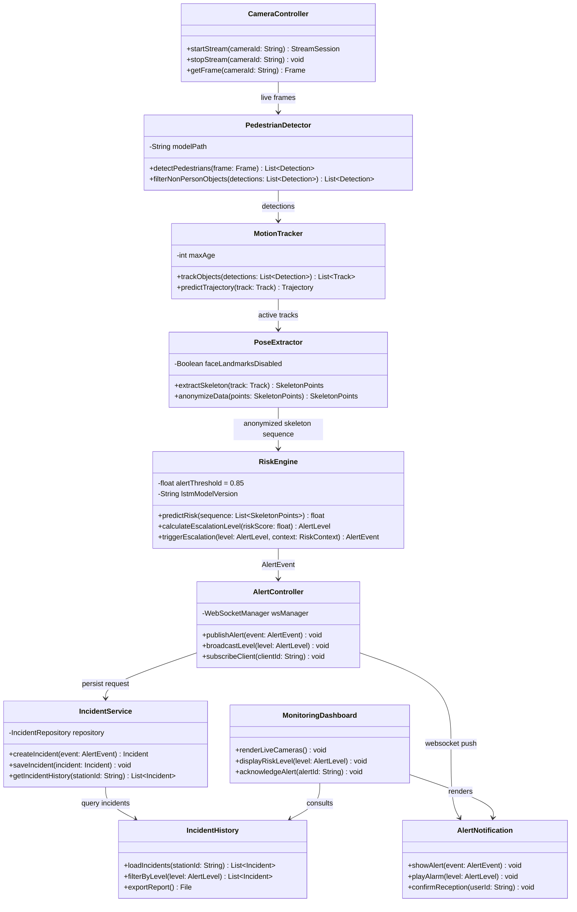

# Sistema de Monitoreo de Incidencias con IA

## Descripción del Proyecto
Andén Seguro es un sistema de monitoreo inteligente basado en el análisis de cámaras de seguridad. Su propósito principal es la detección temprana y prevención de posibles intentos de suicidio en las estaciones de metro.

Mediante el uso de algoritmos de visión artificial, el sistema evalúa el flujo de video en tiempo real para identificar comportamientos de riesgo, permitiendo alertar de manera oportuna e inmediata a los equipos de emergencia. El enfoque central es salvaguardar la vida de los transeúntes, garantizando al mismo tiempo el estricto cumplimiento de las normativas de privacidad de los pasajeros.

### Objetivo General
Diseñar e implementar un sistema de monitoreo inteligente basado en cámaras de seguridad para la detección temprana y prevención de posibles intentos de suicidio, con el fin de alertar oportunamente a los equipos de emergencia y salvaguardar la vida de los transeúntes.

---

## Equipo y Roles

| Nombre | Rol | Responsabilidades Principales |
| :--- | :--- | :--- |
| **Ignacio Essus** | **Líder de Proyecto** | Gestión de hitos, integración de módulos. |
| **Guillermo Salgado** | **Backend Developer** | Lógica de IA (Python), gestión de alertas y API. |
| **Waldo Alonso Chavez** | **Frontend Developer** | Dashboard de monitoreo (React), UI/UX y WebSockets. |

---

## Estándar de Commits (Conventional Commits + ID)
Utilizaremos el formato `<tipo>(<alcance>): <descripción> #<ID_Tarea>`. Esto permite que, al hacer push, la actividad aparezca automáticamente en la tarea de ClickUp.

Tipos de commits sugeridos:

- `feat`: una nueva funcionalidad (ej. el algoritmo de detección).
- `fix`: corrección de un error o bug.
- `docs`: cambios solo en la documentación o Javadoc.
- `refactor`: cambio en el código que no corrige un error ni añade una función (limpieza de code smells).
- `test`: añadir o corregir pruebas.

### Palabras Clave para Cerrar Tareas
Si tu commit finaliza el trabajo de una tarea, incluye una de estas palabras justo antes de `#ID` para que ClickUp la marque como completada automaticamente:

- `fix`, `fixes`, `fixed`
- `close`, `closes`, `closed`
- `resolve`, `resolves`, `resolved`

Ejemplos prácticos para el equipo:

- Ignacio (IA/Core): `feat(ia): implementacion de logica LSTM para deteccion de crisis #8642abc`
- Guillermo (Backend): `feat(db): crear tabla IncidentLog para historial de incidencias #8642def`
- Alonso (Frontend): `feat(ui): diseño de interfaz para Nivel Rojo con alerta sonora #8642ghi`

Ejemplos para ClickUp:

- Para vincular avance (sin cerrar): `feat(ia): configurando pesos iniciales de YOLOv5 #86e0p0a66`
- Para finalizar y cerrar: `docs(readme): actualizacion de manual de automatizacion fix #86e0p0a66`
- Otra forma de cierre: `feat(ui): dashboard de camaras en tiempo real closes #86e0p0a66`

---

## Diseño del Sistema

### Diagrama de Clases
Muestra la relacion entre los componentes principales de deteccion, analisis de riesgo y gestion de incidentes.



### Diagrama de Casos de Uso
Representa como interactuan los actores con el flujo de monitoreo, evaluacion del riesgo y protocolos de intervencion.

```mermaid
usecaseDiagram
    actor AIS as "Sistema de IA"
    actor SEG as "Personal de Seguridad"
    actor JEFE as "Jefe de Estacion"
    actor PAS as "Pasajero en Riesgo"

    rectangle "Anden Seguro" {
        (Monitorear anden en tiempo real) as UC1
        (Detectar anomalias conductuales) as UC2
        (Anonimizar puntos de pose\n sin uso de rostro) as UC3
        (Calcular probabilidad de riesgo y_t) as UC4
        (Clasificar nivel de alerta\n Verde/Amarillo/Naranja/Rojo) as UC5
        (Enviar alerta nivel Amarillo) as UC6
        (Enviar alerta nivel Naranja/Rojo) as UC7
        (Ejecutar acercamiento amable) as UC8
        (Activar protocolo de emergencia) as UC9
    }

    AIS --> UC1
    AIS --> UC2
    AIS --> UC3
    AIS --> UC4
    AIS --> UC5
    AIS --> UC6
    AIS --> UC7

    PAS --> UC2
    PAS --> UC1

    JEFE --> UC6
    SEG --> UC7
    SEG --> UC8
    SEG --> UC9

    UC4 ..> UC5 : <<include>>
    UC5 ..> UC6 : <<extend>>
    UC5 ..> UC7 : <<extend>>
    UC7 ..> UC8 : <<include>>
    UC7 ..> UC9 : <<extend>>
```
