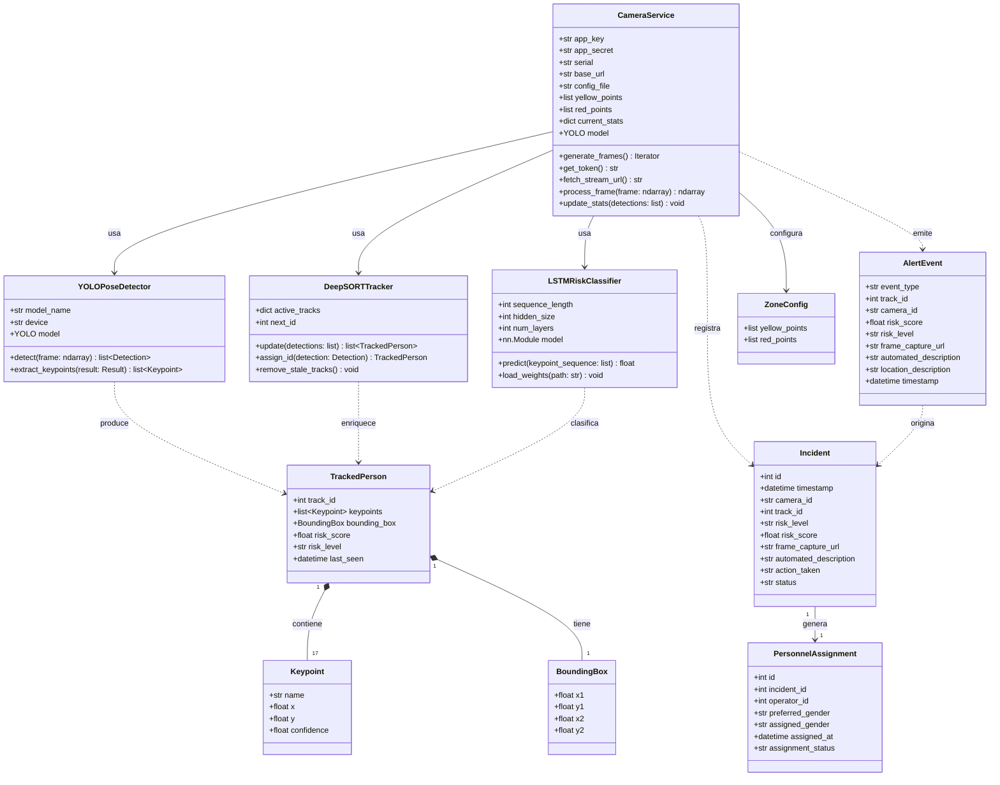
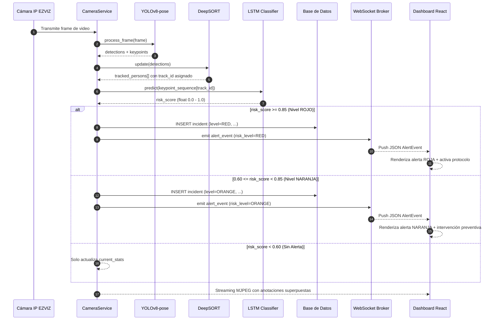

# Andén Seguro — Sistema de Monitoreo Inteligente para Estaciones de Metro


## 1. Descripción del Proyecto

**Andén Seguro** es un sistema de monitoreo inteligente que opera mediante el análisis automatizado de flujos de video de seguridad en tiempo real en estaciones de metro. Su propósito principal es la **detección temprana, evaluación probabilística de riesgos y la prevención de posibles intentos de suicidio o conductas de alta vulnerabilidad** en entornos de infraestructura pública de alto tráfico.

El sistema emplea algoritmos de **visión artificial** (YOLOv8-pose + DeepSORT + LSTM Stacked) para evaluar continuamente el comportamiento de los peatones e identificar patrones de riesgo, tales como inclinarse peligrosamente hacia las vías o traspasar líneas de contención. Cuando la probabilidad de riesgo calculada supera el umbral crítico definido, el sistema activa protocolos de notificación escalonada al personal de la estación en tiempo real.

### 1.1 Impacto Social

El suicidio en el metro es una problemática pública grave que genera trauma en testigos, demora las operaciones y representa un costo humano irreparable. Andén Seguro busca reducir la ventana de reacción del personal de la estación, pasando de una detección reactiva (visual humana) a un sistema proactivo con latencia inferior a 1 segundo.

### 1.2 Marco Legal y Privacidad por Diseño

El sistema opera bajo un estricto marco de **Privacidad por Diseño (Privacy by Design)**, en cumplimiento de:

- **Ley 21.719 (Chile)**: Ley de Protección de Datos Personales, promulgada en 2024, que refuerza los estándares de tratamiento, anonimización y minimización de datos sensibles.
- **Ley 19.628 (Chile)**: Ley sobre protección de la vida privada y sus datos sensibles.

**Principios técnicos aplicados:**

| Principio | Implementación Técnica |
|---|---|
| Anonimización en la fuente | Solo se procesan esqueletos de postura corporal (keypoints). No se almacenan ni procesan rasgos biométricos faciales. |
| Minimización de datos | No se captura ni retiene información identificable de los peatones. |
| Seguridad por defecto | Los datos de postura son procesados en memoria y descartados tras la clasificación. |
| Trazabilidad de incidentes | Solo se registran metadatos no identificables (timestamp, cámara, nivel de riesgo, acción tomada). |

---

## 2. Equipo y Roles

| Nombre | Rol | Responsabilidades Principales |
|---|---|---|
| **Ignacio Essus** | Líder de Proyecto | Gestión de hitos, diseño arquitectónico e integración de módulos. |
| **Guillermo Salgado** | Backend & AI Developer | Lógica de IA (Python), pipeline de visión artificial, gestión de alertas y API REST. |
| **Waldo Alonso Chavez** | Frontend Developer | Dashboard de monitoreo interactivo (React), UI/UX y consumo de canales WebSockets. |

---

## 3. Stack Tecnológico

### 3.1 Backend & Core de Inteligencia Artificial

| Tecnología | Versión Recomendada | Rol en el Sistema |
|---|---|---|
| **Python** | 3.11+ | Lenguaje base del backend y pipeline de IA. |
| **FastAPI** | 0.111+ | Framework asíncrono para la API REST y endpoints de streaming. |
| **Uvicorn** | 0.29+ | Servidor ASGI de alto rendimiento para FastAPI. |
| **Ultralytics (YOLOv8-pose)** | 8.2+ | Detección de personas y extracción de keypoints de postura corporal. |
| **PyTorch** | 2.3+ | Motor de inferencia del modelo LSTM para clasificación de comportamientos. |
| **NVIDIA CUDA** | 12.x | Aceleración por GPU para procesamiento de video en tiempo real. |
| **OpenCV** | 4.9+ | Captura, preprocesamiento y anotación de frames de video. |
| **SQLModel** | 0.0.18+ | ORM declarativo para el registro histórico de incidentes. |
| **python-dotenv** | 1.0+ | Gestión de variables de entorno desde archivos `.env`. |

### 3.2 Frontend

| Tecnología | Versión Recomendada | Rol en el Sistema |
|---|---|---|
| **React** | 18+ | Biblioteca de interfaz de usuario para el dashboard de monitoreo. |
| **Vite** | 5+ | Herramienta de build ultrarrápida para el ecosistema React. |
| **Tailwind CSS** | 3.4+ | Framework de utilidades CSS para el diseño del dashboard. |

### 3.3 Canales de Comunicación en Tiempo Real

| Tecnología | Rol en el Sistema |
|---|---|
| **WebSockets Nativos (FastAPI)** | Transmisión inmediata de alertas de riesgo desde el backend al dashboard (latencia < 1s). |
| **Multipart Streaming (MJPEG)** | Transmisión continua del feed de video anotado desde el backend al frontend. |

---

## 4. Instrucciones de Puesta en Marcha Local

### 4.1 Prerrequisitos del Sistema

Antes de comenzar, verifica que tu entorno cumple con los siguientes requisitos:

- Python `3.11` o superior instalado y accesible desde la terminal.
- Node.js `18` o superior y `npm` instalados.
- (Opcional pero recomendado) GPU NVIDIA compatible con CUDA `12.x` para procesamiento acelerado. Si no se dispone de GPU, el sistema operará en modo CPU.
- Acceso a las credenciales de la cámara IP EZVIZ (variables de entorno).
- Git instalado para clonar el repositorio.

### 4.2 Clonar el Repositorio

```bash
git clone https://github.com/tu-organizacion/anden-seguro.git
cd anden-seguro
```

### 4.3 Configuración del Backend (FastAPI)

#### Paso 1: Crear el entorno virtual de Python

Desde la raíz del proyecto, crea y activa el entorno virtual `.venv`:

```bash
# Crear el entorno virtual
python -m venv .venv

# Activar en Linux / macOS
source .venv/bin/activate

# Activar en Windows (PowerShell)
.venv\Scripts\Activate.ps1

# Activar en Windows (CMD)
.venv\Scripts\activate.bat
```

Una vez activado, el prompt de la terminal mostrará el prefijo `(.venv)`.

#### Paso 2: Instalar las dependencias de Python

```bash
pip install --upgrade pip
pip install -r requirements.txt
```

> **Nota sobre PyTorch con CUDA**: Si tu sistema dispone de GPU NVIDIA, instala la versión CUDA de PyTorch manualmente antes de ejecutar el comando anterior:
> ```bash
> pip install torch torchvision torchaudio --index-url https://download.pytorch.org/whl/cu121
> ```

#### Paso 3: Configurar las variables de entorno

Crea el archivo `.env` en la raíz del proyecto a partir del archivo de ejemplo:

```bash
cp .env.example .env
```

Luego edita el archivo `.env` con tus valores reales:

```dotenv
# ============================================================
# ANDÉN SEGURO — Variables de Entorno del Backend
# ============================================================

# --- Configuración del modelo YOLO ---
# Nombre del archivo del modelo. Opciones: yolov8n-pose.pt, yolov8s-pose.pt, yolov8m-pose.pt
YOLO_MODEL=yolov8n-pose.pt

# --- Credenciales de la Cámara IP EZVIZ ---
# Clave de aplicación otorgada por la plataforma EZVIZ Open API
APP_KEY=tu_app_key_aqui

# Secreto de aplicación otorgado por la plataforma EZVIZ Open API
APP_SECRET=tu_app_secret_aqui

# Número de serie del dispositivo de cámara registrado en EZVIZ
SERIAL=tu_serial_de_camara_aqui

# URL base de la API EZVIZ (no modificar salvo indicación)
BASE_URL=https://isaopen.ezvizlife.com

# --- Configuración de la Base de Datos ---
# Cadena de conexión SQLite para desarrollo local
DATABASE_URL=sqlite:///./anden_seguro.db

# --- Configuración de Seguridad ---
# Umbral de riesgo para activación de protocolo ROJO (RF-06)
RISK_THRESHOLD_RED=0.85

# Umbral de riesgo para activación de alerta NARANJA (RF-07)
RISK_THRESHOLD_ORANGE=0.60

# --- Configuración del Servidor ---
# Host y puerto de Uvicorn
HOST=0.0.0.0
PORT=8000
```

#### Paso 4: Arrancar el servidor FastAPI

```bash
uvicorn main:app --host 0.0.0.0 --port 8000 --reload
```

El flag `--reload` activa la recarga automática ante cambios en el código (solo para desarrollo). El servidor estará disponible en `http://localhost:8000`.

Para verificar que el servidor está operativo, accede a:

- **Health Check**: `http://localhost:8000/`
- **Documentación interactiva (Swagger UI)**: `http://localhost:8000/docs`
- **Documentación alternativa (ReDoc)**: `http://localhost:8000/redoc`

### 4.4 Configuración del Frontend (React + Vite)

#### Paso 1: Navegar al directorio del frontend

```bash
cd frontend
```

#### Paso 2: Instalar las dependencias de Node.js

```bash
npm install
```

#### Paso 3: Configurar las variables de entorno del frontend

Crea el archivo `.env.local` dentro del directorio `frontend/`:

```dotenv
# ============================================================
# ANDÉN SEGURO — Variables de Entorno del Frontend
# ============================================================

# URL base de la API REST del backend
VITE_API_BASE_URL=http://localhost:8000

# URL del WebSocket de alertas en tiempo real
VITE_WS_ALERTS_URL=ws://localhost:8000/api/alerts/ws

# URL del feed de video MJPEG
VITE_VIDEO_FEED_URL=http://localhost:8000/api/stream/video_feed
```

#### Paso 4: Iniciar el servidor de desarrollo de Vite

```bash
npm run dev
```

El dashboard estará disponible en `http://localhost:5173` por defecto.

### 4.5 Verificación del Sistema Completo

Con ambos servidores en ejecución, el flujo operativo completo debería estar activo:

1. El backend captura el feed de la cámara EZVIZ y procesa los frames con YOLOv8-pose.
2. El frontend muestra el video anotado en tiempo real desde `GET /api/stream/video_feed`.
3. Cuando el nivel de riesgo supera el umbral, el backend emite un evento por WebSocket al canal `ws://localhost:8000/api/alerts/ws`.
4. El dashboard React recibe la alerta y muestra la notificación visual con el nivel de escalamiento correspondiente.

---

## 5. Diagramas del Sistema

### 5.1 Diagrama de Clases

Este diagrama modela las entidades centrales del dominio de negocio y sus relaciones estructurales.



### 5.2 Diagrama de Secuencia — Flujo de Detección y Alerta

Este diagrama ilustra la secuencia temporal completa desde la captura de un frame hasta la notificación al operador.



---

## 6. Estructura del Proyecto

```
anden-seguro/
├── .env.example                  # Plantilla de variables de entorno
├── .gitignore
├── main.py                       # Punto de entrada de FastAPI
├── requirements.txt              # Dependencias de Python
├── README.md                     # Este documento
├── api_contract.md               # Contrato técnico formal de la API
│
├── app/
│   ├── api/
│   │   └── routes/
│   │       ├── stream.py         # Endpoints de streaming y configuración
│   │       ├── incidents.py      # Endpoints de registro histórico (RF-09)
│   │       └── personnel.py      # Endpoints de asignación de personal (RF-11)
│   │
│   ├── services/
│   │   ├── camera_service.py     # Orquestador principal del pipeline de IA
│   │   ├── alert_service.py      # Gestión y emisión de alertas WebSocket
│   │   └── personnel_service.py  # Lógica de asignación de operadores
│   │
│   ├── models/
│   │   ├── incident.py           # Modelo ORM de incidente (SQLModel)
│   │   └── personnel.py          # Modelo ORM de asignación de personal
│   │
│   ├── schemas/
│   │   ├── incident_schema.py    # Schemas Pydantic para respuestas de incidentes
│   │   └── alert_schema.py       # Schema Pydantic para eventos de alerta WebSocket
│   │
│   └── websockets/
│       └── alert_ws.py           # Manejador del canal WebSocket de alertas
│
└── frontend/
    ├── .gitignore
    ├── .prettierrc
    ├── eslint.config.js
    ├── index.html
    ├── package-lock.json
    ├── package.json
    ├── README.md
    ├── tsconfig.app.json
    ├── tsconfig.json
    ├── tsconfig.node.json
    ├── vite.config.ts
    └── src/
        ├── App.tsx
        ├── index.css
        ├── main.tsx
        ├── components/
        │   ├── dashboard/
        │   │   ├── AlertCard.tsx
        │   │   ├── InsightCard.tsx
        │   │   ├── MetricCard.tsx
        │   │   ├── Panel.tsx
        │   │   └── StatusList.tsx
        │   └── layout/
        │       ├── AppLayout.tsx
        │       ├── Header.tsx
        │       └── Sidebar.tsx
        ├── hooks/
        │   ├── useDashboardOverview.ts
        │   ├── useElapsedTimer.ts
        │   ├── useIncidentAlerts.ts
        │   └── useLiveCameraOverview.ts
        ├── pages/
        │   ├── ComingSoonPage.tsx
        │   ├── DashboardPage.tsx
        │   └── LiveCameraPage.tsx
        ├── services/
        └── types/
            └── dashboard.ts
```

---
## 7. Flujo de Trabajo con GitFlow

Para el desarrollo del proyecto utilizaremos el modelo GitFlow.

- Rama estable de produccion: `main`.
- Rama de integracion del desarrollo: `dev`.
- Ramas de funcionalidad: `feature/<nombre-funcionalidad>` creadas desde `dev`.
- Ramas de release: `release/<version>` para estabilizacion previa a `main`.
- Ramas de hotfix: `hotfix/<descripcion>` creadas desde `main` para correcciones urgentes.

Reglas operativas:

- Todo trabajo diario se integra primero en `dev` via Pull Request.
- No se trabaja directamente sobre `main`.
- Cada PR debe incluir descripcion clara, pruebas ejecutadas y referencia de tarea (`#ID`).
- Los merges a `main` se realizan mediante `release/*` o `hotfix/*` segun corresponda.

---

## 8. Estándar de Commits (Conventional Commits)
Utilizaremos el formato `<tipo>(<alcance>): <descripción>` para mantener un historial de commits claro y organizado, facilitando la trazabilidad de los cambios relacionados con cada tarea del proyecto.

Tipos de commits sugeridos:

- `feat`: una nueva funcionalidad (ej. el algoritmo de detección).
- `fix`: corrección de un error o bug.
- `docs`: cambios solo en la documentación
- `refactor`: cambio en el código que no corrige un error ni añade una función (limpieza de code smells).
- `test`: añadir o corregir pruebas.

Ejemplos prácticos para el equipo:

- Ignacio (IA/Core): `feat(ia): implementacion de logica LSTM para deteccion de crisis #8642abc`
- Guillermo (Backend): `feat(db): crear tabla IncidentLog para historial de incidencias #8642def`
- Alonso (Frontend): `feat(ui): diseño de interfaz para Nivel Rojo con alerta sonora #8642ghi`

---

*Actualizacion del readme 24-05-2026 — Proyecto Andén Seguro.*
